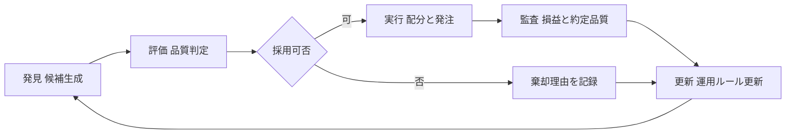
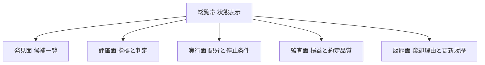
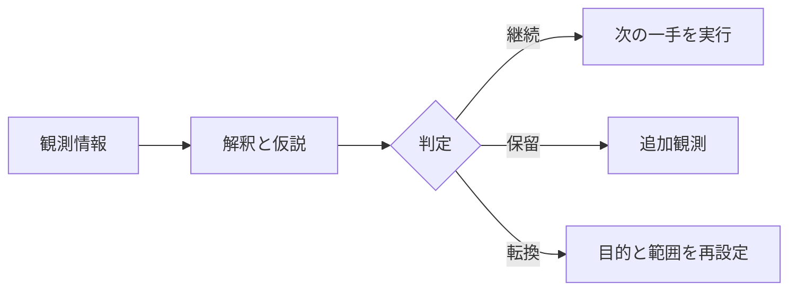

# 運用統制画面 仕様書

## 1. 目的
本画面の目的は次の三点に限定する。

- 採用候補を迅速に判定する
- 実行可否を安全に判定する
- 結果を監査可能な形で残す

## 2. 対象
- 運用責任者
- 売買担当者
- 監査担当者

## 3. 基本方針
- 一画面で全体を把握できる構成にする
- 発見 評価 実行 監査の順序を固定する
- 事実と推測を分離して表示する
- 不合格理由を必ず表示する
- 実行前に停止条件を必ず確認する
- 監査情報は元記録へ必ず辿れるようにする
- 次の一手を最小コスト順で表示する

## 4. 全体構成

## 5. 画面構成

## 6. 各面の要件

### 6.1 総覧帯
- 現在状態を一行で表示する
- 実行停止中かどうかを常時表示する
- 最終更新時刻を表示する

### 6.2 発見面
- 候補ごとの要因とデータ鮮度を表示する
- 候補は評価点順に並べる
- 欠損データがある候補は警告表示にする

### 6.3 評価面
- 主要指標を同一尺度で表示する
- 基準値と実測値を並べて表示する
- 不合格時は理由を一行で表示する

### 6.4 実行面
- 配分案を銘柄単位で表示する
- 注文上限を超える案は送信不可にする
- 異常時停止と緊急停止を常設する

### 6.5 監査面
- 日次損益を時系列で表示する
- 約定品質を時系列で表示する
- 監査記録の参照先を必ず表示する

### 6.6 履歴面
- 棄却理由を時系列で表示する
- 運用ルール更新内容を時系列で表示する
- 各履歴に更新責任を表示する

## 7. 機能一覧
- 機能一 候補表示
  発見面で候補を評価点順に表示する
- 機能二 判定表示
  評価面で基準値と実測値を並べて表示する
- 機能三 棄却理由表示
  不合格候補の理由を一行で表示する
- 機能四 配分表示
  実行面で銘柄ごとの配分案を表示する
- 機能五 送信制御
  注文上限超過と停止条件違反時は送信不可にする
- 機能六 緊急停止
  実行停止操作を常時表示し即時反映する
- 機能七 損益監査
  監査面で日次損益を時系列表示する
- 機能八 約定品質監査
  監査面で約定品質を時系列表示する
- 機能九 記録参照
  表示値から元記録へ遷移できる
- 機能十 更新履歴
  履歴面で棄却理由と運用ルール更新を追跡できる
- 機能十一 判定ラベル
  継続 保留 転換の三段階を表示する
- 機能十二 記録区分
  固定点 追記 未確定を分離して記録する

## 8. 主要指標
- 見込み優位
- 実現損益
- 最大下落率
- 変動率
- 配分比率
- 約定ずれ
- 回転率

## 9. 操作ルール
- 主要操作は三手以内で完了する
- 画面遷移なしで判定理由を確認できる
- 停止操作は常に最上位に表示する
- 無効操作には理由を表示する

## 10. データ要件
- 受信遅延は一分以内を目標とする
- 欠損時は空欄にせず欠損表示にする
- 過去値の上書きを禁止する
- 表示値と監査記録値の一致を検証する

## 11. 受入基準
- 発見から採用判定までを一画面で完結できる
- 不合格候補の理由が全件追跡できる
- 実行前に停止条件の確認を必須化できる
- 監査面から元記録へ全件遷移できる
- 更新履歴が時系列で欠落なく表示できる
- 判定を継続 保留 転換の三段階で表示できる
- 固定点 追記 未確定を分けて記録できる

## 12. レビュー判定

- 継続は前提と制約が揃っている状態
- 保留は情報不足で手戻りが大きい状態
- 転換は目的と設計の不整合がある状態

## 13. 実装順序
1. 総覧帯 発見面 評価面を実装する
2. 実行面の停止条件と送信制御を実装する
3. 監査面と履歴面を実装する
4. 受入基準を満たすことを確認する
