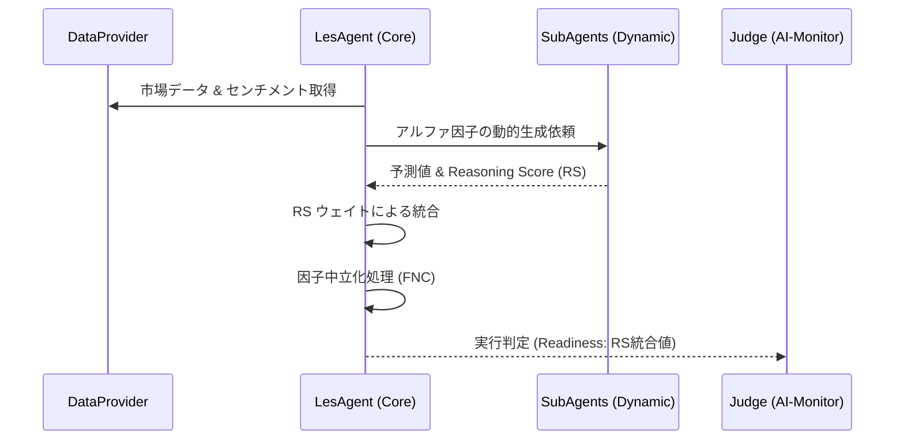

# ユーザーストーリー：コア・インテリジェンス（稼働中のエージェント）

## LES (Large-scale Stock Forecasting)
- **クオンツ運用の意思決定者として**、**LES フレームワーク**（ArXiv:2409.06289）を活用し、LLM によるアルファ因子の動的生成を実現したい。
    - **KGI (投資期待成果)**: 
        - 年間超過収益 (Alpha): 8% - 15% (市場環境に応じた段階的目標)
        - リスク調整後リターン (Sharpe Ratio): 1.5 以上
    - **KPI (運用評価指標)**: 
        - 推論結果によるアルファ減衰抑制率: 年率 5% 改善
        - 独自開発因子による収益寄与額: ポートフォリオ全体の 60% 以上
        - 予測方向性誤差率 (Directional Error Rate): 45% 以下
    - **利益獲得への具体パス**: 
        1. LLM が従来の統計モデルが見落とす「非線形なセンチメント変化」をアルファ因子として抽出。
        2. 直近 1 時間のトレンドに基づき動的にポートフォリオをリバランス。
        3. 小さな価格歪みを累積し、超過収益を低ドローダウンで獲得する。

- **クオンツ・アナリストとして**、意思決定の論理的根拠を定量化した **Reasoning Score (RS)** を導入し、AIの判断を客観的に評価したい。
    - **成果目標**: 各推論ステップに対し、RS (0.0-1.0) を付与し、RS > 0.7 のシグナルのみを「高信頼」として運用する。

## PEAD (Post-Earnings Announcement Drift)
- **アクティブ運用のトレーダーとして**、純利益だけでなく**売上高成長率 (Revenue Surprise)** を加味した高度な SUE ロジックにより、決算発表後の持続的なドリフトを捉えたい。
    - **KGI (投資期待成果)**: 
        - 戦略別合計期待収益: 年率 10% 以上
        - 決算イベントあたり平均リターン: 1.5% 以上
    - **KPI (運用評価指標)**: 
        - 情報比率 (Information Ratio): 0.8 以上
        - 決算後 5 営業日ヒット率: 55% 以上
        - 最大ドローダウン (MDD): 証拠金比 5% 以内
    - **利益獲得への具体パス**: 
        1. 売上高サプライズが伴う「質の高い決算」を選別し、機関投資家の追随買いを先回りする。
        2. 決算発表翌日の寄り付きでエントリーし、3-5 日間の「ドリフト」期間を確実にキャプチャ。
        3. 取引あたりの平均リターンを、年間数百回の決算イベントで複利運用する。

## オプション戦略 (Strategy Y)
- **収益向上プログラムのマネージャーとして**、**ボラティリティ・リスク・プレミアム (VRP)** を安定的に収穫するため、デルタ・ニュートラルな OTM プット売り戦略を実行したい。
    - **KGI (投資期待成果)**: 
        - オプション・プレミアム収益: 月次 1.0% - 1.5%
        - ポートフォリオ通算勝率: 80% 以上
    - **KPI (運用評価指標)**: 
        - デルタ露出 (Market Exposure): ±0.1 以内
        - セータ (Theta) 収穫効率: IV の 60% 以上を確保
        - ガンマ・リスク耐性: 証拠金維持率 200% 以上を常時維持
    - **利益獲得への具体パス**: 
        1. 実現ボラティリティよりも高く設定される IV の差（VRP）を OTM オプション販売で徴収。
        2. ブラック・ショールズ・モデルによる精密なデルタ制御で原資産変動リスクを最小化。
        3. プレミアム蓄積をロングポジションのレバレッジ原資とし、トータルリターンを底上げする。

## マクロ・ハイブリッド (Commodity Macro)
- **マクロ戦略家として**、**金・銅比率 (Gold/Copper Ratio)** を通じて市場のリスクオン/オフを定量化し、株式アルファの比重を最適化したい。
    - **KGI (投資期待成果)**: 
        - 景気後退期の資産防衛力: 市場下落率に対しドローダウンを 20% 以上軽減
    - **KPI (運用評価指標)**: 
        - マクロ・リスクオン/オフ判定適中率: 60% 以上
        - 株式/現金比率の切り替え精度: 指標検知から 24時間以内
    - **利益獲得への具体パス**: 
        1. 金・銅比率が拡大（金高/銅安）した際、株式リスクを削減。
        2. 市場全体が下落する前に防衛的なアロケーションへ移行。
        3. 回復局面で銅価格の反発を検知し、順次ポジションを復元する。

## 汎用クオンツ・エクセレンス（検証基準）
- **リスク管理者として**、システムの「誠実さ」を測る指標として **CORR**, **MMC**, **FNC** および **Fama-French Five-Factor Model** を重視したい。
    - **KGI (投資期待成果)**: 
        - ポートフォリオの市場中立性 (Beta Neutrality): 0.1 以下
        - Meta-Model Contribution (MMC): 常に正の期待値を維持
    - **KPI (運用評価指標)**: 
        - FNC (Feature Neutral Corr): 0.015 以上
        - 統計的有意性 (t-Stat): 2.0 以上
        - 推論誤差率 (Tracking Error): 年率 3% 以内
    - **利益獲得への具体パス**: 
        1. 予測値と実現値の相関（CORR）だけでなく、他のモデルとの相違点（MMC）を報酬対象とする。
        2. 特定の因子（セクター等）への偏りを FNC で中立化し、真のアルファを抽出。
        3. 5因子解析により、市場全体の動きに依存しない収益であることを証明する。
