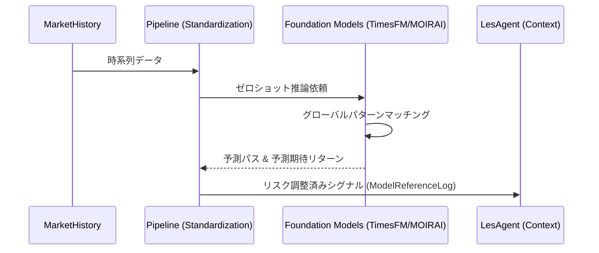
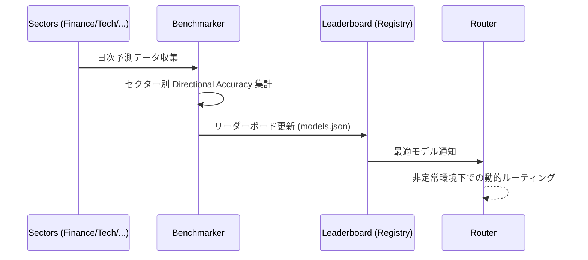

# ユーザーストーリー：時系列基盤モデル (TS Foundation Models)

## モデルレジストリとマルチモデル対応
- **リサーチャーとして**、**統合ユニットモデルレジストリ** (`models.json`) で様々な時系列基盤モデル（Chronos, TimesFM, Lag-Llama, MOIRAI）を一元管理したい。これにより、異なる予測エンジンの切り替えやアンサンブルが容易になる。
- **開発者として**、標準化された推論インターフェース (`run_inference.py`) を通じて、エージェントのコアロジックを変更することなく新しい基盤モデルを追加できるようにしたい。

## Foundation Model Zero-Shot Forecasting
- **予測モデル開発者として**、**TimesFM** や **MOIRAI** などの基盤モデル（Foundation Models）を活用したゼロショット予測を行いたい。
    - **詳細要件**: 未知の銘柄や非定常なマーケットデータに対しても、過去の学習データに過学習（Overfitting）することなく、安定した方向性予測を提供する。
    - **KGI (投資期待成果)**: 
        - 銘柄選択適中率 (Directional Accuracy): 52% 以上（市場予測の優位性確立）
        - ゼロショット予測による投資機会損失の低減: 年間 10% 以上の利益機会追加
    - **KPI (運用評価指標)**: 
        - 価格予測誤差率 (RMSE) 改善率: 伝統的統計モデル比 5% 以上
        - モデル・アンサンブルによるリスク調整後収益改善: Sharpe +0.1 以上
        - Overfitting 検知: 学習データとテストデータの損失乖離率 15% 以内で維持
    - **利益獲得への具体パス**: 
        1. 新規上場銘柄や急激なレジーム変化時など、個別学習データが不十分な環境で基盤モデルを活用。
        2. 独自の個別銘柄学習と基盤モデルのゼロショット予測を精度重み付け（ModelReferenceLog RS）でアンサンブル。
        3. 市場全体のトレンド追随精度を高めることで、機会損失を最小化し、安定したリターンを積み上げる。

- **データサイエンティストとして**、特定の銘柄のヒストリカルデータが不足している（新規上場やデータ欠損）場合でも、**TimesFM (Google)** や **MOIRAI (Salesforce)** といった数千億トークンで事前学習された基盤モデルを活用したい。これにより、その銘柄固有の学習なしに、過去の一般的な市場パターンから次の一歩（Next-Step）を**「ゼロショット」**で推論したい。
- **データエンジニアとして**、基盤モデルの推論結果を標準化された **ModelReferenceLog** 形式で出力し、後続の `LesAgent` が「モデルの予測期待リターン」として利用できるようにパイプラインを精緻化したい。

## 財団（ファンデーション）の特定とベンチマーク
- **パフォーマンスエンジニアとして**、単一の最強モデルを探すのではなく、**セクター別（金融、テック、製造など）のリーダーボード**を自動生成したい。例えば「テック株には TimesFM が強く、バリュー株には Chronos が強い」といった、コンテキストに応じた最適な「財団」を特定したい。
## Sector-Specific Benchmarking
- **ポートフォリオ・マネージャーとして**、基盤モデルの性能をセクター・アセットごとに精緻にベンチマークしたい。
    - **詳細要件**: 金融、テクノロジー、ヘルスケアなどのセクターごとに「リーダーボード」を生成し、どのモデルがどの市場環境に最適かを判定する。
    - **KGI (投資期待成果)**: 
        - セクター別アルファの安定化: モデル最適化後、年間利回りバラツキを 20% 抑制
        - 統合ポートフォリオの Sharpe Ratio: 1.5 以上
    - **KPI (運用評価指標)**: 
        - モデル・ルーティング成功率: セクター平均勝率 52% 以上
        - モデルリスク分散係数: 特定モデル依存度を 50% 以下に抑制
        - モデル切り替え頻度: 最低保持期間 5 営業日 (過剰なリバランスの防止)
    - **利益獲得への具体パス**: 
        1. セクターごとに「方向的一致率 (DA)」が最も高いモデルを自動選定。
        2. モデルの得意不得意に合わせた資金分配の最適化。
        3. モデル固有のエラーによる損失を分散し、ポートフォリオ全体のリスク調整後リターンを改善する。

- **クオンツ・アナリストとして**、MAE（平均絶対誤差）や RMSE（平方二乗平均客観誤差）だけでなく、**「方向的一致率 (Directional Accuracy)」**を用いてモデルを評価したい。単なる数値の近さではなく、「明日上がるか下がるか」を正しく当てられるモデルを優先する実証的なフレームワークを構築したい。
