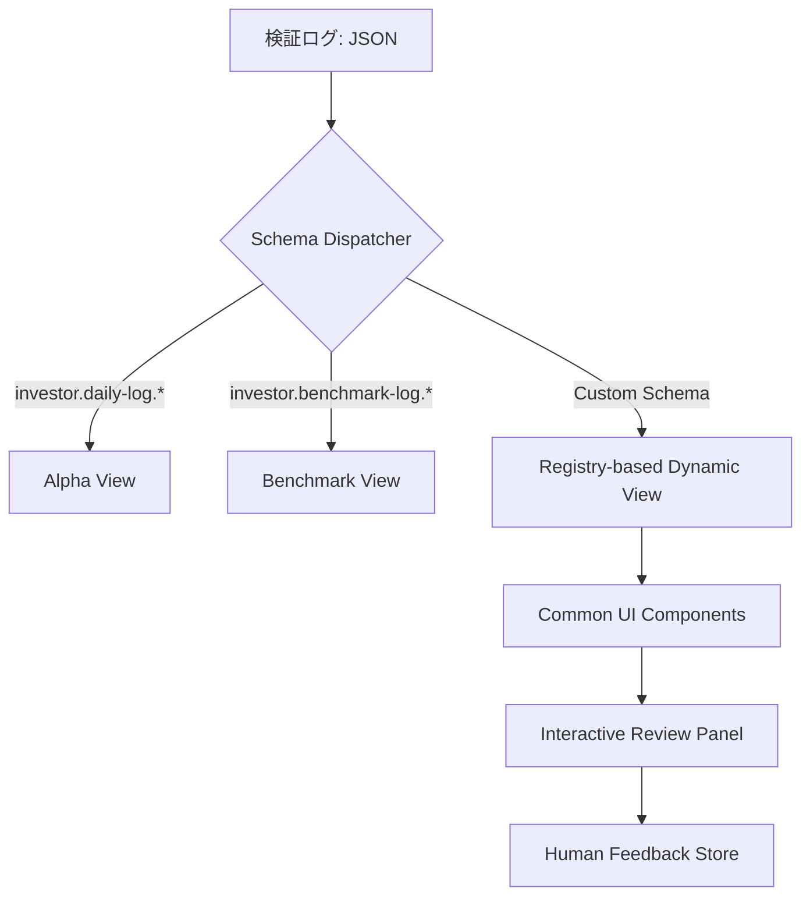

# ユーザーストーリー：将来のロードマップ（未実装・有用な機能）

## 1. まだできていないこと (Pending Features)
- **クオンツ開発者として**、複数の銘柄を組み合わせた**ポートフォリオ最適化機能**を実装したい。これにより、単一期待値의 最大化ではなく、システム全体の Expected Shortfall を制御した運用が可能になる。

## 2. 有ったら役立つこと (Nice to Have / Experimental)

### 2.1 次世代フロントエンド：汎用ビューアーと自動同期
「構造の工夫」により、フロントエンドを単なる「事後確認パネル」から、拡張性の高い「意思決定補助・自動監視センター」へと進化させる。

- **システム・アーキテクトとして**、**プラグイン・ベースのコンポーネント構造**を採用したい。
    - 各検証結果（Schema）に応じた「ビュー・テンプレート」を JSON 自体に持たせる、あるいはフロントエンド側で動的にロードする仕組み。これにより、新戦略の追加時にフロントエンドのコードを一切触らずに専用の可視化が可能となる。
- **クオンツ開発者として**、特定のデータ構造に依存しない**汎用スキーマ・ビューアー**を実装したい。
    - ログファイルに定義されたメタデータや JSON Schema を読み取り、新しい検証結果（グラフ、テーブル、指標）を自動的にレンダリングする。
- **クオンツ・エージェントとして**、検証完了後に**自動的に `docs/arxiv/*.md` 形式のレポートを生成**し、知見を永続化したい。
    - 成功・失敗を問わず、実証結果を標準化されたフォーマットで文書化し、開発者や他のエージェントが参照可能なナレッジベースを構築する。
- **クオンツ・アナリストとして**、過去のシミュレーション結果や LES の推論パスをインタラクティブにドリルダウンできるチャート機能を追加し、AI の「思考プロセス」への理解を深めたい。

#### 推奨アーキテクチャ設計（Vision）

