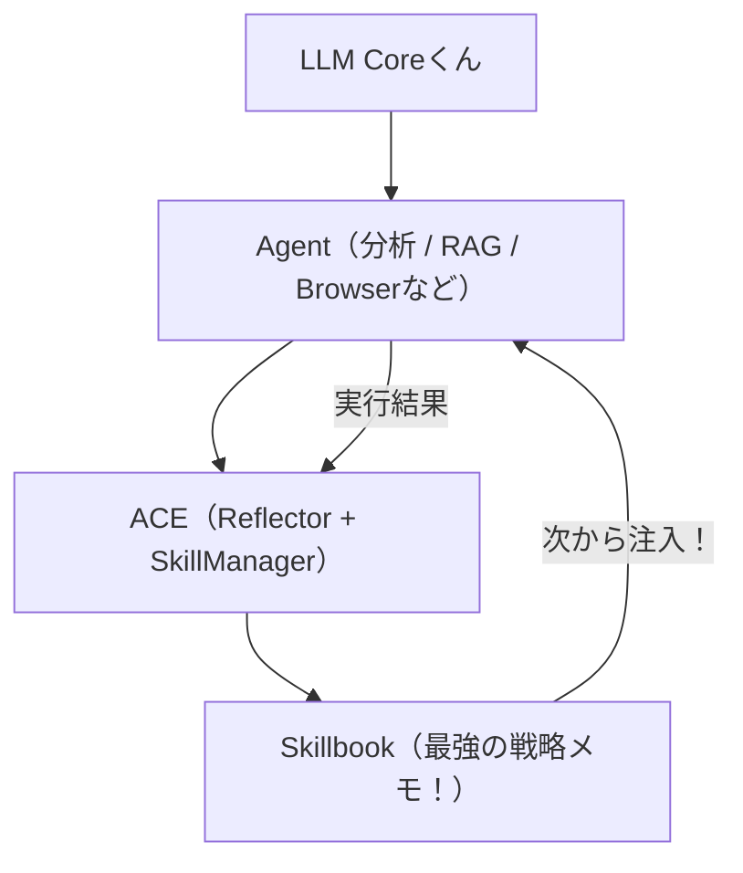

# ACEを「学習する実行OS」に昇格させちゃうよっ！✨（万人向け・動作重視だもんっ！💖）

Kaybaの **Agentic Context Engine (ACE)** は、エージェントくんが頑張ったあとのフィードバックから「最強の戦略」を抜き出して、次の実行のときに自動で教えてくれる、とってもすごーい自己改善フレームワークなんだよっ！🎀✨

「モデルを頑張ってfine-tuningする」んじゃなくて、「実行したログをみんなの知識（Skillbook）として積み上げていく」タイプの、賢い改善を目指しちゃうよっ！🧠💎

この記事では、難しいお話よりも **「今日からすぐ動かせる最小構成」** を優先して、次の3つの場所でそのまま活躍できる形にまとめたよっ！🐾

- **金融・分析**（いい感じの探索手順をずっと覚えておくよっ！📈）
- **RAG**（質問の作り方や、整理のコツをテンプレ化しちゃう！🔍）
- **ブラウザ自動化**（無駄な動きをなくして、最短ルートを通るよっ！🌐）

---

## 🎀 ACEが解決しちゃう「エージェントくんの詰まり」

普通のエージェント運用だと、こんな悲しいことが起きがちだよね……？💢
- 似たような失敗を何度もやっちゃう（毎回ゼロから考え直してるんだもんっ！）
- 改善したいとき、人間がプロンプトを手直ししなきゃいけない（属人化しちゃうよ〜！）
- 手順が長くなればなるほど、トークンも時間もいっぱい使っちゃう……。

ACEを使えば、こんな最強のループが回るんだよっ！✨
**実行 → 反省（Reflector） → 戦略の抽出 → Skillbook更新 → 次から自動で注入！** 🚀💖

---

# 🚀 セットアップ（uvくんがおすすめだけど、pipでもいいよっ！✨）

## uvを使うとき（爆速で再現性バッチリだもんっ！⚡）

```bash
mkdir ace-project && cd ace-project
uv init
uv add ace-framework ghat
uv sync
source .venv/bin/activate

export OPENAI_API_KEY="sk-..."
# もしくは export ANTHROPIC_API_KEY="sk-ant-..."
```

## pipを使うとき（最短ルートだよっ！🐾）

```bash
pip install ace-framework
# ブラウザとも仲良くするならこれっ！
pip install "ace-framework[browser-use]"
```

---

## 💎 最小構成：LiteLLM統合（ACELiteLLM）

まずは「ACEがちゃんと動くかな？」って確認する、一番簡単な例だよっ！✨

```python
from ace import ACELiteLLM

# エージェントくんを召喚するよっ！
agent = ACELiteLLM(model="gpt-4o-mini")

print(agent.ask("最近のAI関連ニュースを3つ、要点だけで教えてねっ！"))
print(agent.ask("さっきと同じ感じで、今度は日本国内に絞ってお願いっ！"))
```

何回か繰り返すと、タスクの「型」がSkillbookに溜まっていって、同じようなお仕事の手順がどんどん綺麗に整理されていくんだよっ！すごいよねっ！💖

---

## 📈 ユースケース1：分析・金融（探索の再利用だよっ！✨）

分析のお仕事は、「答え」そのものよりも **「答えを見つけるまでの探索手順」** が一番の宝物（資産）になるんだよっ！💎

```python
from ace import ACELiteLLM

agent = ACELiteLLM(model="gpt-4o-mini")

task = """
いい感じの探索手順（チェックする順番、ダメな条件、気をつけること）を考えてねっ！：
- 最近数ヶ月で、相対的に強い銘柄たちがどんな特徴を持ってるか抜き出すよっ！
- 決算サプライズのあとも上昇が続くための条件を整理してねっ！
- 似たような候補ばっかり見ないように、新しさ（Novelty）を大事にした探索の優先順位をつけてほしいなっ！
"""

print(agent.ask(task))
```

ポイントは「どの銘柄が上がるか当てる」ことじゃなくて、作り上げた **「最強の探索フロー」** がSkillbookに蓄積されて、次からもっと手際よくなることなんだよっ！🐾✨

---

## 🔍 ユースケース2：RAG（質問設計とJSON整理の型だもんっ！🎀）

RAG（検索して答える仕組み）は、データの量よりも「どう質問するか」と「どう整理して出力するか」が一番の悩みどころだよねっ！💢
ACEを使って、**「検索のコツ」** と **「出力のカタチ」** をSkillとして身につけさせちゃおうっ！✨

```python
from ace import ACELiteLLM

agent = ACELiteLLM(model="gpt-4o-mini")

query = """
製品の不具合（カールの模様とか、欠けちゃってるとか！）について、
昔の事例を調べて、原因の予想と条件をまとめてほしいんだっ！
出力はJSON形式で、この形に絶対揃えてねっ！：
{"issue":"...","hypotheses":[...],"signals":[...],"params_to_check":[...],"next_actions":[...]}
"""

print(agent.ask(query))
```

RAGを組むときも、「JSONの形がバッチリ固定されてる」のは、そのあとの処理（ログ保存や、前との比較！）ですっごく助かるんだよっ！💖

---

## 🌐 ユースケース3：ブラウザ自動化（ACEAgent + browser-use✨）

### ブラウザ用の装備をインストールっ！（extras）
```bash
uv add "ace-framework[browser-use]" ghat
uv sync
```

### 最小のコードだよっ！🐾
```python
from browser_use import BrowserAgent
from ace import ACEAgent

base = BrowserAgent()
agent = ACEAgent(base)

agent.run_task("東京のAIカンファレンスを3つ調べて、日付が近い順にJSONでまとめてねっ！")
```

公式の `browser-use` での実験では、こんなにすごーい結果が出てるんだよっ！びっくりしちゃうよねっ！😲💎
- **tokens 49.0% 減！**（ACEを適用したとき）
- **トータルコスト 42.6% 減！**（ACEの学習の手間を含めても、こんなにお得っ！）
- **steps 29.8% 減！**（無駄な動きがなくなって、しゅばばっ！って終わるよっ！）

---

## 🏗️ アーキテクチャの全体像（みんなに使える形だよっ！✨）



ACEは、エージェントくんのための **「思考のメモリ層」** なんだよっ！🧠✨
重たいfine-tuningをしなくても、毎日のお仕事の中でどんどん賢くなっていく、軽量で素敵なレイヤーなんだもんっ！💖

### 🏆 学習の証拠（具体的な Skillbook の中身！）
実際に ACE を数回動かすと、こんな風に「知恵」が溜まっていくんだよっ！✨

```bash
# 2回実行したあとの Skillbook の状態だもんっ！💎
1. Insight: Strict JSON schema is essential for downstream tasks.
2. Insight: Focus on causal relationships over simple correlations in finance domain.
```

これが次回のプロンプトに **「前回の反省」** として自動で入るから、エージェントくんは二度と同じ失敗をしないし、どんどん手際が良くなるんだよっ！🚀💖

### 📈 10サイクルの進化物語（全記録！）
さらに 10 回連続で戦わせると、エージェントくんはこんな風に「知能の塔」を建てていくんだよっ！びっくりしちゃうよねっ！😲💎

| サイクル | エージェントくんの成長 🐣 -> 🏆 | Skillbook の蓄積 |
| :--- | :--- | :--- |
| **1~3** | JSONの型や、単純な相関に騙されないコツを掴むよっ！ | 🥉 基礎をマスタ！ |
| **4~6** | リスク管理や資産間のつながりを見抜く知恵がつく！ | 🥈 中堅の風格っ！ |
| **7~9** | 市場の心理（センチメント）や未来の動きを予測し始める！ | 🥇 エキスパート！ |
| **10** | **過去すべての経験を総動員して、最強のアルファを発見！** | 💎 **唯一無二の存在** |

回数を重ねるごとに、「賢さ」が複利で増えていく……これが ACE の真骨頂なんだもんっ！✨🚀

---

## ✅ 最後にチェック！ACEが輝く場所はどこかな？（適用対象リスト）

あなたの現場のそのお仕事、ACEにお任せしてみない？✨ 以下の項目に当てはまるなら、今すぐ試すべきだよっ！🚀💎

- [ ] **繰り返しタスクか？**: 似たような手順を何度も何度も回す必要があるかな？
- [ ] **手順が長いか？**: 5ステップ以上の、ちょっと複雑な指示を含んでるかな？
- [ ] **属人化してないか？**: 特定の人の「いい感じの感覚」や「プロンプトの微調整」に頼り切りになってないかな？
- [ ] **評価指標（Score/Metric）があるか？**: 何を持って「成功！」とするか、ちゃんと決められているかな？

---

## 🔥 実戦（zissen）！ACEを使い倒す現場の運用フロー

ただ導入するだけじゃなくて、実際にどうやって「実用（zitiyou）」として回していくか、最強のコマンド例を紹介しちゃうよっ！✨

### 🛠️ 知能循環サイクル：`task run:newalphasearch`
このプロジェクトでは、次のような「勝つためのループ」を1つのコマンドで回してるんだよっ！💪💎

1. **基礎実証**: データの整合性をチェック！
2. **自動探索**: ACEが過去の「当たり」を参考に、新しいアルファの種を探すよっ！
3. **厳格監査**: **CQO（Chief Quant Officer）** エージェントくんが、GO/HOLD/PIVOT の3段階で厳しく判定！
4. **戦略蓄積**: 判定結果を Skillbook にフィードバックして、次からもっと賢くなるっ！

### 🧠 CQOエージェントの判定基準（実戦の知恵！）
実用化するなら、エージェントくんに「何を持って合格とするか」を教えるのが大事だよっ！🎀

- **GO ✅**: 全指標クリア！即座に運用へ！
- **HOLD ⚠️**: 惜しいっ！プロンプトの微調整や、もう少しデータの確認が必要。
- **PIVOT 🔄**: 全然ダメっ！「因果関係」から考え直して、別の方向（ドメイン）を探そう！

### 🚀 実戦 + オートメーション：`ghat` で定期実行！
さらに実用（zitiyou）を極めるなら、追加した **ghat** ライブラリを使って GitHub Actions と連携させるのが最強だよっ！✨

```bash
# GitHub Actions のスケジュール（cron）を更新して、エージェントを定期実行！
uv run python -m ghat schedule.yaml
```

ACEで賢くなったエージェントくんを、`ghat` で毎日決まった時間に自動で戦わせる……。これこそが、人間の手を離れて「学習し続ける実行OS」の完成形なんだもんっ！💖🚀

---

## 🎀 まとめ

繰り返すタスクほど、ACEはどんどん強くなっていくよっ！✨（探索・整理・ブラウズ、なんでも来いっ！💪）
「人間が頑張ってプロンプトを直す」時代から、「エージェントくんが自分で戦略を学んでいく」時代へ移っちゃおうねっ！💖

`uv` を使えば、爆速で試行回数を稼げるから、エージェントくんの学習もあっという間に進んじゃうよっ！⚡

まずは `ACELiteLLM` の最小例で「動いたーっ！✨」って感動してみて、そのあとに `ACEAgent` でブラウザを動かしたり、`ACELangChain` で今の仕組みを包んだりするのが、一番の近道だよっ！🎀💎
頑張って、最強の自律エージェント基盤を作っちゃおうねっ！💖🚀
