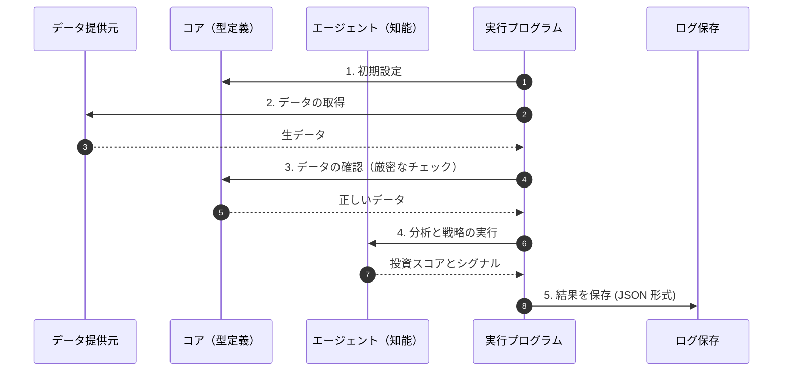

# ts-agent：投資システムの中心部

このプロジェクトは、自律型投資エンジンの心臓部です。

## 🧬 システムの流れ



## 🚀 使い方

```bash
# 必要なソフトをインストール
bun install

# 分析プログラムを実行
bun run start
```

## 🏗️ フォルダの中身

- `src/agents/`: 分析を行う「知能」部分。
- `src/use_cases/`: 具体的な実行手順（データの流れ）。
- `src/experiments/`: 新しい投資戦略を試す場所。
- `src/schemas/`: データが正しいか厳密にチェックする定義。
- `src/providers/`: 外部サービスとの連携。

---
このプロジェクトは Bun を使用して作成されています。
💖🚀💰✨
