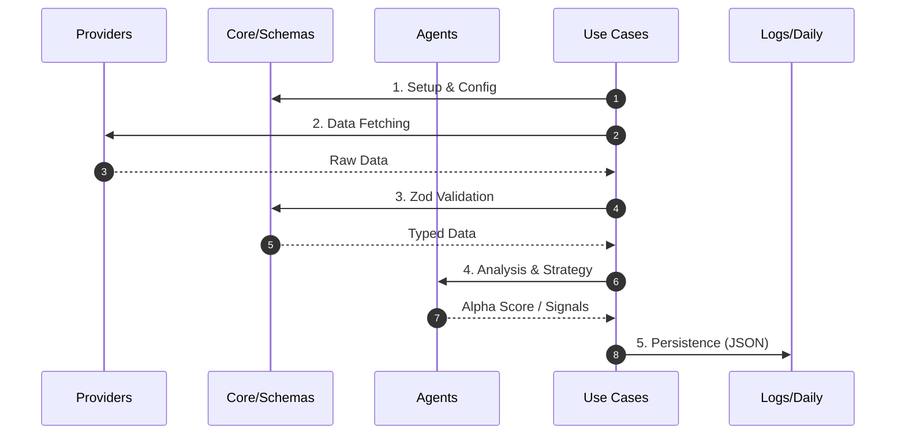

# ts-agent

To install dependencies:

```bash
# 🤖 Investor Agent (TypeScript Core) ✨



自律型投資エンジンの心臓部だよっ！

## 🚀 実行方法

```bash
# 依存関係のインストール
bun install

# デイリー・ワークフロー（野菜インフレ検証）の実行
bun run start
```

## 🏗️ ディレクトリ構造

- `src/agents/`: 知能ユニット。
- `src/use_cases/`: 具体的な実行手順（野菜検証フローなど）。
- `src/experiments/`: 戦略の実験場。
- `src/schemas/`: Zod による厳格なバリデーション。
- `src/providers/`: 外部 API 連携。

This project was created using `bun init` in bun v1.3.9. [Bun](https://bun.com) is a fast all-in-one JavaScript runtime.
