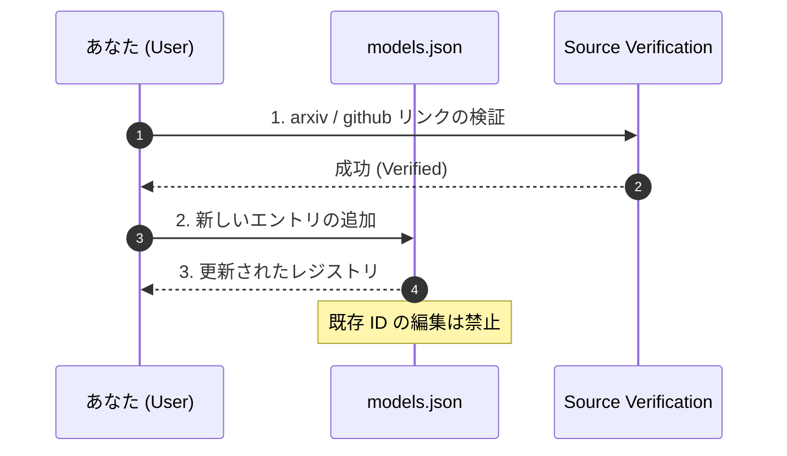

# Model Registry (Link-Only)

This directory is a minimal registry for external forecasting models.

- No local model implementation.
- No local wrapper maintenance.
- Keep only canonical links and IDs.

## Files

- `models.json`: machine-readable model registry.

## Usage

- For `Context7`, use `context7LibraryId`.
- For papers, use `arxiv`.
- For implementation sources, use `github`.

## Policy

- Add a new entry instead of editing historical IDs.
- Keep fields non-empty when a source is verified.
- Keep this registry vendor-agnostic and scenario-agnostic.

## 🚀 Registered Models (Foundation & Alpha)

`models.json` に登録されている主要な予測モデルのカタログだよっ！✨

| Model ID | Vendor | Category | Key Features | Docs |
| :--- | :--- | :--- | :--- | :--- |
| **amazon-chronos** | Amazon | TS Forecasting | Transformer-based zero-shot univariate forecasting. | [ArXiv](https://arxiv.org/abs/2403.07815) |
| **google-timesfm** | Google | TS Forecasting | Pre-trained foundation model for time-series. | [ArXiv](https://arxiv.org/abs/2310.10688) |
| **microsoft-timeraf** | Microsoft | TS Forecasting | Retrieval-Augmented zero-shot forecasting for Finance. | [ArXiv](https://arxiv.org/abs/2412.20810) |
| **salesforce-moirai** | Salesforce | TS Forecasting | Any-variate zero-shot transformer. | [ArXiv](https://arxiv.org/abs/2402.02592) |
| **lag-llama** | Lag-Llama Team | TS Forecasting | Llama-based probabilistic zero-shot forecasting. | [ArXiv](https://arxiv.org/abs/2310.03274) |
| **les-forecast** | Yang et al. | Alpha Generation | Multi-agent framework for stock alpha generation (LES). | [ArXiv](https://arxiv.org/abs/2409.06289) |
