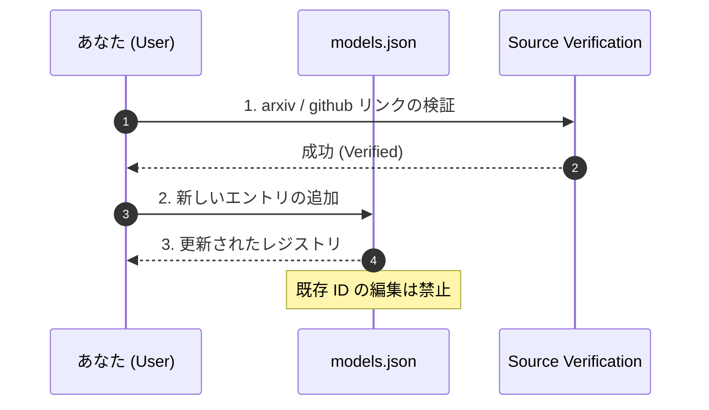

# Model Registry (Link-Only)

This directory is a minimal registry for external forecasting models.

- No local model implementation.
- No local wrapper maintenance.
- Keep only canonical links and IDs.

## Files

- `models.json`: machine-readable model registry.

## Usage

- For `Context7`, use `context7LibraryId`.
- For papers, use `arxiv`.
- For implementation sources, use `github`.

## Policy

- Add a new entry instead of editing historical IDs.
- Keep fields non-empty when a source is verified.
- Keep this registry vendor-agnostic and scenario-agnostic.
