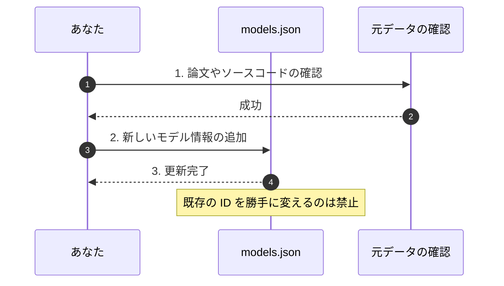

# モデル・レジストリ：外部 AI モデルの管理

このディレクトリは、時系列予測モデル（AI モデル）の情報を管理する場所です。



## ルール
- ローカルでの実装は行わず、公式のリンクと ID のみを管理します。
- 過去の ID は変更せず、新しい情報を追加するようにします。
- 特定のメーカーや状況に依存しない、中立な情報を保ちます。

## 🚀 登録されている主なモデル

| モデル ID | 開発元 | 役割 | 解説 |
| :--- | :--- | :--- | :--- |
| **amazon-chronos** | Amazon | 時系列予測 | Amazon による強力な時系列予測モデル |
| **google-timesfm** | Google | 時系列予測 | Google の時系列基盤モデル |
| **microsoft-timeraf** | Microsoft | 時系列予測 | 金融向けの RAG 予測モデル |
| **salesforce-moirai** | Salesforce | 時系列予測 | 万能型の予測モデル |
| **les-forecast** | Yang et al. | 投資アルファ生成 | 多くの AI で株価予測を行うフレームワーク |

## 🛠️ インストールの確認
Python 環境でこれらのモデルが正しくインストールされているかは、以下のコマンドで確認できます。

```bash
task verify
```
