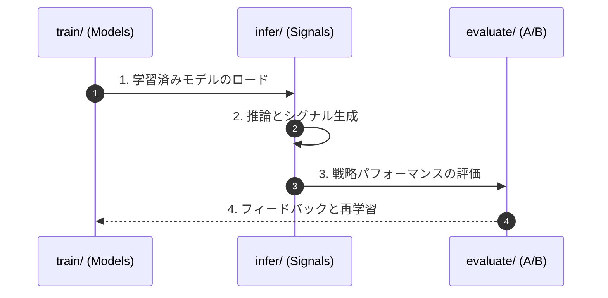

# Pipeline Layers

- `train/`: training workflows for reusable models.
- `infer/`: inference workflows for generating live/paper signals.
- `evaluate/`: evaluation and benchmark workflows.

Current benchmark and pipeline entrypoints:

- `src/pipeline/evaluate/foundation_benchmark.ts`: Foundation Model metrics.
- `src/pipeline/evaluate/run_full_validation.ts`: **Unified Pipeline Entrypoint** (All stages).
