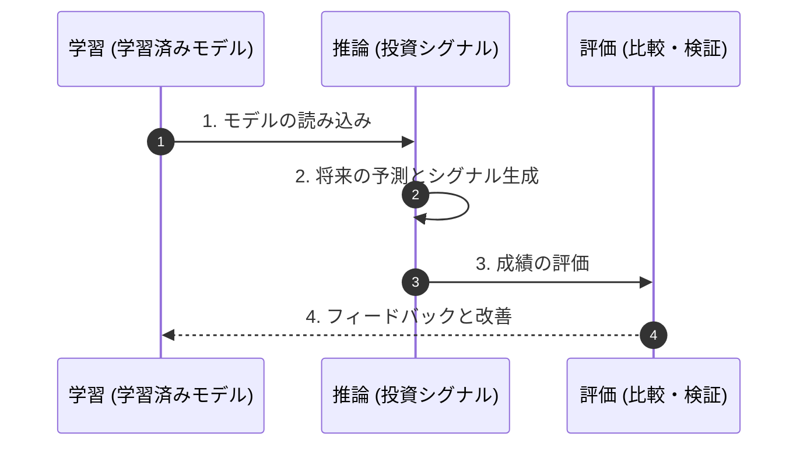

# パイプライン：処理の流れ

投資システムのデータの流れ（パイプライン）について説明します。

```mermaid
sequenceDiagram
    autonumber
    participant T as 学習 (学習済みモデル)
    participant I as 推論 (投資シグナル)
    participant E as 評価 (比較・検証)

    T->>I: 1. モデルの読み込み
    I->>I: 2. 将来の予測とシグナル生成
    I->>E: 3. 成績の評価
    E-->>T: 4. フィードバックと改善
```

- `train/`: モデルの学習に関するプログラム。
- `infer/`: 実際の予測を行い、投資指示（シグナル）を出すプログラム。
- `evaluate/`: 成績の評価やベンチマーク（比較テスト）を行うプログラム。
